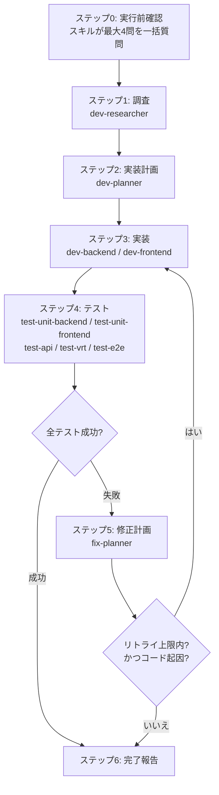

# code-implementer 全体設計

API仕様書（OpenSpec.yml）・画面仕様書（Markdown）を入力として、対象リポジトリのアプリケーションコードを「技術調査 → 実装計画 → 実装 → テスト → 修正ループ」のワークフローで自動実装するプラグインの設計ドキュメント。

- 関連PBI: takakaka-rbs/learningDev-Docs#25
- 対象SBI: #26（本書）、#27〜#34（各コンポーネント実装）

## 設計原則

1. **対象リポジトリ非依存**: プラグイン定義に特定リポジトリのパス・パッケージ名・コマンドを書かない。リポジトリ固有情報（構成・規約・ビルド/テスト実行コマンド）はすべて `dev-researcher` が実行時に調査し、調査レポート（リポジトリプロファイル）として下流エージェントに受け渡す
2. **メイン会話がオーケストレーター**: orchestrator プラグインの方針（SessionStart フックによるメイン会話ルーティング）に合わせ、ワークフローの進行管理は `/code-implementer` スキル（メイン会話）が行う。サブエージェント同士は直接呼び合わない
3. **成果物はファイルで受け渡す**: エージェント間の入出力は、対象リポジトリ内の作業ディレクトリに置く Markdown ファイルを正とする。サブエージェントの返信テキストは要約にすぎない（コンテキスト切れ・再開に耐えるため）
4. **初回一括確認・以降は自動完遂**: エコシステム共通の運用規則に従う。質問はスキル開始時の実行前確認1回のみ（最大4問）。以降は報告のみで完遂し、不可逆な破壊的操作のみ例外として確認する
5. **第一弾のサポート対象スタック**: Java: Spring Framework / Vue3 / PostgreSQL。エージェントの調査・実装ノウハウはこのスタックを前提に記述するが、リポジトリプロファイルの形式自体はスタック非依存とする

## ワークフロー全体像



## コンポーネント一覧と責務

### スキル（エントリーポイント）

| スキル | 責務 |
|---|---|
| `/code-implementer` | 実行前確認、各エージェントの起動順序の管理、成果物ファイルの受け渡し、修正ループの制御（リトライ回数・終了条件の判定）、最終報告 |

### エージェント

| エージェント | 担当SBI | 責務 | model |
|---|---|---|---|
| `dev-researcher` | #27 | 対象リポジトリの構成・規約・実行コマンドの調査（リポジトリプロファイル）と、対象機能の実装方式（Spring / Vue3 / PostgreSQL での実現方法）の調査 | claude-sonnet-4-6 |
| `dev-planner` | #27 | 調査レポートと仕様書から実装計画（対象ファイル・実装順序・影響範囲）を作成 | セッション継承 |
| `dev-backend` | #28 | API仕様書の API-XXX 単位で Spring のバックエンド（Controller / Service / Repository / Entity 相当）を実装 | セッション継承 |
| `dev-frontend` | #29 | 画面仕様書の SCR-XXX 単位で Vue3 のフロントエンド（画面コンポーネント・API呼び出し・状態管理）を実装 | セッション継承 |
| `test-unit-backend` | #30 | JUnit 単体テスト（Service 層中心）の作成・実行・結果レポート出力 | claude-sonnet-4-6 |
| `test-unit-frontend` | #30 | Vitest 単体テスト（コンポーネント・ロジック）の作成・実行・結果レポート出力 | claude-sonnet-4-6 |
| `test-api` | #31 | API仕様書から RestAssured による APIテスト（正常系・異常系・ビジネスルール）の作成・実行・結果レポート出力 | claude-sonnet-4-6 |
| `test-vrt` | #32 | 画面仕様書から Storybook ストーリーの作成と VRT の実行・結果レポート出力（未導入時は導入手順の案内） | claude-sonnet-4-6 |
| `test-e2e` | #33 | 画面遷移・ユースケースから Playwright E2E テストの作成・実行・結果レポート出力 | claude-sonnet-4-6 |
| `fix-planner` | #34 | テスト結果レポートの分析、失敗原因の分類、修正計画の作成（再作業の指示書） | セッション継承 |

model の方針: コード実装・計画・修正分析はセッションのモデル（通常は最上位モデル）を継承し、定型度が高い調査・テスト作成は `claude-sonnet-4-6` に固定する。

### ツール割り当て方針

| エージェント | tools |
|---|---|
| dev-researcher | Read, Glob, Grep, Bash（コマンド存在確認等の読み取り系のみ）, WebFetch, WebSearch |
| dev-planner / fix-planner | Read, Glob, Grep（読み取り専用。ファイル出力は呼び出し元のスキルが行うのではなく、Write のみ許可して自身の成果物ファイルを書く）→ Read, Glob, Grep, Write |
| dev-backend / dev-frontend | Read, Glob, Grep, Edit, Write, Bash（コンパイル・生成・lint 実行） |
| test-* | Read, Glob, Grep, Edit, Write, Bash（テスト実行） |

## 成果物（エージェント間で受け渡す情報）

### 作業ディレクトリ

対象リポジトリ直下の `.claude/code-implementer/` を作業ディレクトリとする（デフォルト。実行前確認で変更可）。Git 管理に含めない想定のため、対象リポジトリの `.gitignore` に `.claude/code-implementer/` を追記することを初回にユーザーへ報告する（勝手にコミットはしない）。

```
<対象リポジトリ>/.claude/code-implementer/
├── research-report.md          # dev-researcher の出力（リポジトリプロファイル + 実装方式調査）
├── implementation-plan.md      # dev-planner の出力（fix-planner が改訂を追記）
├── test-reports/
│   └── <level>-attempt<N>.md   # 各テストエージェントの出力（例: unit-backend-attempt1.md）
└── fix-plans/
    └── fix-plan-attempt<N>.md  # fix-planner の出力
```

### 成果物の形式

各成果物の必須セクションは [artifact-templates.md](artifact-templates.md) に定義する。要点:

- **調査レポート（research-report.md）**: 「1. リポジトリプロファイル」（技術スタック・ディレクトリ構成・命名規約・ORマッパー等の利用方法・コード生成の有無・ビルド/リント/テスト/起動コマンド・テスト用DBの構成）と「2. 実装方式調査」（対象機能を当該スタックで実現する方式・参考情報）の2部構成。下流の全エージェントはこのプロファイルに**必ず**従う
- **実装計画（implementation-plan.md）**: タスク一覧（ID: TASK-XXX / 担当: backend・frontend / 対象ファイル / 依存関係 / 対応する API-XXX・SCR-XXX）、実装順序、影響範囲、テスト方針
- **テスト結果レポート（test-reports/*.md）**: 全テストエージェント共通形式。サマリー（対象レベル・実行コマンド・成功/失敗件数）、失敗ケース一覧（テストID / 対象 API-XXX・SCR-XXX / 期待値・実際値 / エラーメッセージ・スタックトレース抜粋 / 関連ファイル）、成果物パス（スクリーンショット等）。**fix-planner が機械的に読める見出し構成を厳守する**
- **修正計画（fix-plans/*.md）**: 失敗ケースごとの原因分類・修正対象ファイル・修正内容・再実行すべきテストレベル・担当エージェント（dev-backend / dev-frontend）

### 仕様書との参照関係

- 入力仕様書は既存プラグインの成果物形式を前提とする: 要件定義書（REQ-F-XXX / UC-XXX）、OpenSpec.yml（API-XXX）、画面仕様書（SCR-XXX / CMP-XXX / EVT-XXX）
- 実装・テストの単位は API-XXX（バックエンド）と SCR-XXX（フロントエンド）。成果物・レポート内では必ずこれらのIDで仕様書を参照し、逆方向（仕様書への書き込み）は行わない
- 仕様書に不備・矛盾を見つけた場合は修正せず、レポートの「仕様起因の課題」に記録して最終報告する（修正は `/openapi-specificater` 等の担当）

## SKILLからの起動フロー

### ステップ0: 実行前確認（唯一の質問タイミング）

最大4問の一括質問。自明な項目は聞かない。

1. **対象リポジトリのパス**（カレントが対象リポジトリと判別できる場合は聞かない）
2. **入力仕様書の場所と実装スコープ**（対象の API-XXX / SCR-XXX の範囲。引数から自明なら聞かない）
3. **実行するテストレベル**（unit-backend / unit-frontend / api / vrt / e2e から選択。デフォルト: unit + api。vrt / e2e はツール未導入なら提案のみ）
4. **修正ループの最大リトライ回数**（デフォルト: 3）

### ステップ1〜6

1. **調査**: `dev-researcher` に対象リポジトリと実装スコープを渡し、`research-report.md` を出力させる
2. **計画**: `dev-planner` に調査レポートと仕様書のパスを渡し、`implementation-plan.md` を出力させる。スキルは計画を**報告として**提示し、承認を待たずに続行する
3. **実装**: 計画のタスク順に `dev-backend` / `dev-frontend` を起動する。各エージェントは担当タスクの実装後、コンパイル・ビルドが通ることを確認して完了報告する
4. **テスト**: 選択されたテストレベルを `unit-backend → unit-frontend → api → vrt → e2e` の順に実行する（前段の失敗が後段のノイズになるため、失敗したレベルで一旦停止して修正ループに入る）
5. **修正ループ**: 失敗レポートを `fix-planner` に分析させ、修正計画に従って `dev-backend` / `dev-frontend` に再作業させる。再作業後は失敗したレベルから再実行する（修正が前段レベルの対象コードに及んだ場合はそのレベルから再実行）
6. **完了報告**: 実装ファイル一覧・テスト結果・採用した仮定・未解決の課題（仕様起因・環境起因を含む）をサマリーとして提示する

## 修正ループの終了条件

修正ループは以下のいずれかで終了する。

| 条件 | 挙動 |
|---|---|
| 選択された全テストレベルが成功 | 正常完了として報告 |
| 同一テストレベルのリトライ回数が上限（デフォルト3回）に到達 | ループを打ち切り、未解決の失敗一覧と分析結果を報告 |
| fix-planner が失敗を「仕様起因」に分類 | そのケースはコード修正の対象外とし、仕様側の課題として記録して残りを続行 |
| fix-planner が失敗を「環境起因」に分類 | 環境の修正方法を報告に含めて当該レベルをスキップし、残りを続行 |
| ワークフロー全体の再実装回数が上限（リトライ上限 × テストレベル数）を超過 | 安全弁として全体を打ち切り報告 |

失敗原因の分類は `fix-planner` が行う: **実装起因**（コード修正で解決 → 修正ループ対象）/ **テスト起因**（テストコード自体の誤り → テストエージェントに修正させる。リトライ回数にカウントしない）/ **仕様起因** / **環境起因**。

## リポジトリ固有情報の調査・受け渡し方法

1. `dev-researcher` がリポジトリプロファイル（research-report.md 第1部）として以下を調査・記録する
   - 技術スタックとバージョン（ビルドファイル・lockファイルから）
   - ディレクトリ構成・レイヤー構成・パッケージ/モジュール命名規約（既存コードの実例つき）
   - DBアクセス方式（JPA / jOOQ / MyBatis 等）と、その利用方法の実例
   - コード生成の有無（OpenAPI Generator・スキーマからの生成等）と、生成物を再生成するコマンド。**生成されたコードを手で編集してはならない旨をプロファイルに明記する**
   - ビルド / lint / テスト / アプリ起動 / DB マイグレーションの実行コマンド（Makefile・npm scripts・mvn/gradle 等の実在するタスク定義から抽出し、推測のコマンドは「未確認」と明記）
   - テスト用DB・テスト環境の構成（docker-compose、devcontainer、インメモリDB等）
2. 下流エージェントの定義には「リポジトリプロファイルに従うこと。プロファイルにない規約を発明しないこと」を制約として記述する。各エージェントへの入力は常に `research-report.md` のパスで渡す
3. プロファイルで確認できなかった項目は、各エージェントが既存コードの類似実装を最優先の根拠として判断し、採用した仮定を成果物・レポートに明記する

## プラグイン構成（確定）

```
plugins/code-implementer/
├── .claude-plugin/
│   └── plugin.json
├── README.md
├── docs/
│   ├── architecture.md            # 本書
│   └── artifact-templates.md      # 成果物テンプレート（調査/計画/テスト/修正）
├── agents/
│   ├── dev-researcher.md
│   ├── dev-planner.md
│   ├── dev-backend.md
│   ├── dev-frontend.md
│   ├── test-unit-backend.md
│   ├── test-unit-frontend.md
│   ├── test-api.md
│   ├── test-vrt.md
│   ├── test-e2e.md
│   └── fix-planner.md
└── skills/
    └── code-implementer/
        └── SKILL.md
```

## orchestrator ルーティングへの登録方針

プラグイン完成時（SBI #34）に、orchestrator プラグインの `hooks/routing-table.md` の担当タスク一覧へ以下を追加する。

| ユーザーの依頼 | 委譲先スキル | 調査専用サブエージェント |
|---|---|---|
| 仕様書からのアプリコード自動実装（実装〜テスト〜修正） | `code-implementer` | `dev-researcher` |

- `/code-implementer` は実行前確認を伴うため、ルーティング規則1に従いメイン会話上で Skill ツールから起動する（サブエージェントへは委譲しない）
- 調査のみの独立依頼（「このリポジトリの構成と規約を調べて」等）は `dev-researcher` に直接委譲してよい
- routing-table.md の変更に伴い orchestrator プラグインのバージョンを patch up し、marketplace.json のエントリと揃える

## バージョン・規約準拠

- 新規プラグインとして `plugin.json` / marketplace.json エントリともに `0.1.0` で登録する
- コミットは commitlint.config.js の Conventional Commits に従う（プラグイン追加は `feat`、設計ドキュメントのみの変更は `docs`）
- ルート README.md のプラグイン一覧へ追記する

## 検証方針（learning-dev）

- 検証対象は learning-dev リポジトリ（Spring Boot + jOOQ + Flyway + OpenAPI Generator / Vue3 + Vite + Vitest / PostgreSQL / Makefile によるタスク定義）
- learning-dev は「コード生成（OpenAPI Generator・jOOQ codegen）を含む」「Makefile にコマンドが集約されている」という点で、リポジトリプロファイルの検出能力を検証するのに適している
- 小さい機能1件（API 1本 + 画面1枚程度）で「仕様書 → 実装 → テスト → 修正」の通しフローを試行する（SBI #34 の完了条件）
