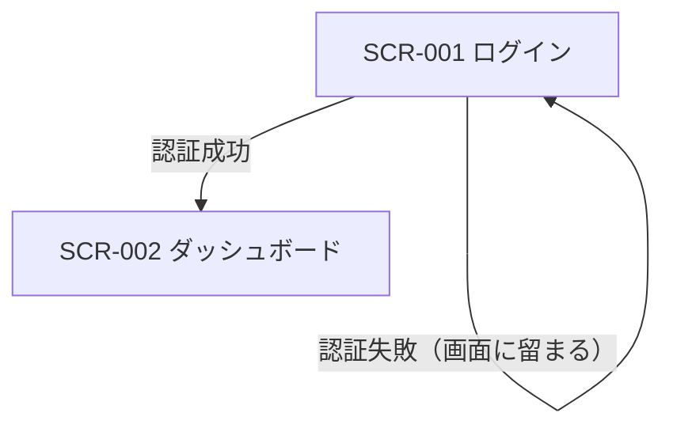

<!--
  画面仕様書テンプレート（screen-specificater プラグイン用）

  ## この文書の位置づけ

  画面仕様書は「要件を満たす具体的な画面」を定義する文書です。
  実装者が本書だけで画面を正しく実装できるレベルまで書きます。

    要件定義書                  … サービスが満たすべき要件を抽象的に定義する
      ↑ REQ-F-XXX を参照
    OpenSpec.yml（API仕様書）   … 要件を満たす具体的なAPIを定義する
      ↑ API-XXX を参照
    画面仕様書（本書）          … 要件を満たす具体的な画面を定義する

  参照は常に「本書 → 要件定義書」「本書 → OpenSpec.yml」の一方向です。
  参照先の文書に画面番号（SCR-XXX）を書く必要はありません。

  ## ファイル構成

  本テンプレートは「Part 1: index.md」と「Part 2: 画面別ファイル」の2部構成です。
  実際の成果物では2つの別ファイルに分けてください。

    docs/screens/               ← 出力先ルートはユーザーに確認する
    ├── index.md                ← Part 1 をコピーして作成
    ├── SCR-001-login.md        ← Part 2 を画面ごとにコピーして作成
    └── images/                 ← 注釈付き画像（例: SCR-001-layout.png）

  ## 書き方の指針

  - APIのリクエスト/レスポンス定義は書かない（API-XXX の参照に留める）
  - 色・余白・フォントなどビジュアルデザインの詳細は書かない（画像とデザインデータに委ねる）
  - フレームワーク・状態管理ライブラリなどの実装方式は書かない
  - レイアウトは、コンポーネント番号を注釈した画像（ユーザーが用意）で表現する。
    1画面に複数枚（状態変化の前後など）あってよい。画像ごとに
    「注釈番号 → CMP-XXX」対応表を置き、仕様の記述は CMP-XXX / EVT-XXX 側に書く
  - 未記入の項目には `_(未記入)_` を、未提供の画像には `_(画像未添付)_` を残し、
    確定した時点で置き換える。残したまま完成扱いにしない

  ## ID 採番ルール

  - SCR-XXX  : 画面（ファイル名・遷移図・他画面からの参照に使う不変ID）
  - CMP-XXX  : コンポーネント（画面仕様書全体で一意。画像の注釈番号は画像ごとに
               振り直されるため、IDとしては使わない）
  - EVT-XXX  : イベントハンドラー（画面仕様書全体で一意。CMP-XXXに紐付く）
  - OPEN-XXX : 未確定事項（本書スコープ。要件定義書・OpenSpec.ymlの採番とは独立）

  XXX は 001 から始まる3桁の連番（必要なら桁を増やす）。
  既存の画面仕様書を更新する場合、既存IDは変更せず欠番のまま維持すること
  （実装・テスト・他文書からの参照が壊れるため）。

  「GUIDE:」で始まるHTMLコメントは記入ガイドです。
  最終成果物では本コメントブロックと GUIDE コメントをすべて削除し、本文のみを残してください。
-->

<!-- GUIDE: ここから Part 1: index.md（画面一覧・画面遷移・共通規約）の雛形 -->

# 画面仕様書

<!-- GUIDE: サービス・プロダクトの正式名称に置き換える -->
**サービス名**: _(未記入)_

| 項目 | 内容 |
|---|---|
| 文書バージョン | 0.1.0 |
| 最終更新日 | _(未記入)_ |
| 作成者 | _(未記入)_ |
| ステータス | ドラフト |

## 1. この文書について

<!-- GUIDE:
  本書の目的・対象読者と、参照する文書へのリンクを書く。
  要件定義書・OpenSpec.yml の実際のパスに置き換えること。
-->

| 参照文書 | パス |
|---|---|
| 要件定義書 | _(未記入)_ |
| OpenSpec.yml（API仕様書） | _(未記入)_ |

## 2. 画面一覧

<!-- GUIDE:
  サービスの全画面を列挙する。ファイル列は画面別ファイルへの相対リンクにする。
  対応要件には要件定義書に実在する REQ-F-XXX のみを書く。
-->

| SCR ID | 画面名 | ファイル | 概要 | 対応要件 |
|---|---|---|---|---|
| SCR-001 | _(未記入)_ | [SCR-001-xxx.md](SCR-001-xxx.md) | _(未記入)_ | REQ-F-XXX |

## 3. 画面遷移図

<!-- GUIDE:
  Mermaid で画面間の遷移を描く。ノードは SCR-XXX を含める。
  条件付きの遷移（認証状態・権限・操作結果による分岐）はエッジのラベルに書く。
-->

<!-- GUIDE: 図で表現しきれない遷移条件・例外遷移（セッション切れ等）があれば補足する -->

## 4. 共通規約

<!-- GUIDE:
  全画面に共通するルールをここに集約し、画面別ファイルでは差分のみ書く。
  既存コードベースがある場合は現行の慣習を調査して合わせることを検討する。
-->

### 4.1 認証・権限による表示制御の基本方針

<!-- GUIDE: 例: 未認証はログインへリダイレクト。権限がない機能はボタン非表示（無効化ではなく） -->

_(未記入)_

### 4.2 エラー表示の方式

<!-- GUIDE: トースト・インライン・ダイアログの使い分け。APIエラー（4xx/5xx）の共通ハンドリング -->

_(未記入)_

### 4.3 ローディング表示の方式

<!-- GUIDE: 例: 画面全体はスケルトン、ボタン操作はボタン内スピナー。多重送信の防止方針 -->

_(未記入)_

### 4.4 入力バリデーションのタイミング

<!-- GUIDE: 例: フォーカスアウト時に項目単位で検証し、送信時に全項目を再検証する -->

_(未記入)_

### 4.5 対象デバイス・ブレークポイント

<!-- GUIDE: 例: PCのみ / PC・スマホ両対応。対応する場合の主要ブレークポイント -->

_(未記入)_

## 5. 未確定事項

<!-- GUIDE:
  複数画面にまたがる未確定事項をここに書く。画面固有のものは各画面ファイルに書く。
  OPEN-XXX の採番は画面仕様書全体（index + 全画面ファイル）で一意にする。
-->

| ID | 内容 | 確認先 | ステータス |
|---|---|---|---|
| OPEN-001 | _(未記入)_ | _(未記入)_ | 未解決 |

<!-- GUIDE: ここから Part 2: 画面別ファイル（SCR-XXX-<画面名スラッグ>.md）の雛形。
     画面ごとにこの Part をコピーして1ファイルずつ作成する -->

# SCR-XXX 画面名

<!-- GUIDE: 遷移元・遷移先は SCR-XXX で書き、該当ファイルへの相対リンクにする -->

| 項目 | 内容 |
|---|---|
| URL / ルート | _(未記入)_ |
| 対応要件 | REQ-F-XXX |
| 対象ユーザー・権限 | _(未記入)_ |
| 遷移元 | [SCR-XXX](SCR-XXX-xxx.md) |
| 遷移先 | [SCR-XXX](SCR-XXX-xxx.md) |

## 1. 画面の目的・利用場面

<!-- GUIDE:
  誰が何のためにこの画面を使うのか。対応するユースケース（UC-XXX）があれば書く。
-->

_(未記入)_

## 2. レイアウト

<!-- GUIDE:
  コンポーネント番号を注釈した画像を埋め込む。画像はユーザーが用意する
  （Figmaのエクスポート、Playwrightスクリーンショットへの注釈など）。
  状態変化を示す場合は「初期表示」「入力エラー時」のように画像を分けてよい。
  画像ごとに「注釈番号 → CMP-XXX」対応表を必ず置く。
  画像が未提供の間は _(画像未添付)_ を残し、OPEN-XXX に記録する。
-->

### 2.1 初期表示

| 注釈番号 | CMP ID | コンポーネント名 |
|---|---|---|
| 1 | CMP-XXX | _(未記入)_ |

## 3. コンポーネント一覧

<!-- GUIDE:
  この画面に配置される全コンポーネントを列挙する。
  種別は TextInput / Button / Table / Modal のような抽象的な部品種別で書く
  （特定のUIライブラリのコンポーネント名にしない）。
  関連イベントには、そのコンポーネントが起点となる EVT-XXX を書く。
-->

| CMP ID | 名称 | 種別 | 概要 | 関連イベント |
|---|---|---|---|---|
| CMP-XXX | _(未記入)_ | _(未記入)_ | _(未記入)_ | EVT-XXX |

## 4. 入力バリデーション

<!-- GUIDE:
  入力系コンポーネントの制約とエラーメッセージを列挙する。タイミングが
  共通規約（index.md 4.4）と異なる場合のみタイミング列を追加する。
  入力項目がない画面ではこのセクションを「なし」とする。
-->

| CMP ID | 制約 | エラーメッセージ |
|---|---|---|
| CMP-XXX | _(未記入)_ | _(未記入)_ |

## 5. イベントハンドラー仕様

<!-- GUIDE:
  この画面の全イベントを EVT-XXX ごとに記述する。
  「トリガー → 事前条件 → 処理 → 成功時 → エラー時」がすべて埋まっていること。
  API呼び出しを伴う場合は OpenSpec.yml に実在する API-XXX を必ず参照する。
  エラー時は「起こりうるエラーごと」に画面の挙動を書く（表示・遷移・入力値の保持）。
  各行の記入例:
    トリガー   → クリック / 送信 / 変更 / 画面表示時
    事前条件   → バリデーション全項目通過（なければ「なし」）
    処理       → API-001 を呼び出す
    成功時     → SCR-002 へ遷移する
    エラー時   → 401: インラインでエラー文言を表示し画面に留まる（入力値は保持）
-->

### EVT-XXX イベント名

| 項目 | 内容 |
|---|---|
| 対象コンポーネント | CMP-XXX |
| トリガー | _(未記入)_ |
| 事前条件 | _(未記入)_ |
| 処理 | _(未記入)_ |
| 成功時 | _(未記入)_ |
| エラー時 | _(未記入)_ |

## 6. 表示制御

<!-- GUIDE:
  権限・条件によるコンポーネントの出し分けを書く。共通規約（index.md 4.1）で
  カバーされるものは書かず、この画面固有の制御のみ書く。なければ「なし」とする。
  挙動の例: 非表示 / 無効化 / 読み取り専用
-->

| 対象 | 条件 | 挙動 |
|---|---|---|
| CMP-XXX | _(未記入)_ | _(未記入)_ |

## 7. 状態仕様

<!-- GUIDE:
  画面全体の状態ごとの表示を定義する。初期表示でデータ取得を行う場合は
  取得元の API-XXX を書く（画面表示時イベントとして EVT-XXX に切り出してもよい）。
  例: 初期表示 → API-002 で一覧を取得して表示する
-->

| 状態 | 表示 |
|---|---|
| 初期表示 | _(未記入)_ |
| ローディング | _(未記入)_ |
| 空（0件） | _(未記入)_ |
| エラー | _(未記入)_ |

## 8. 未確定事項

<!-- GUIDE:
  この画面固有の未確定事項。OPEN-XXX の採番は画面仕様書全体で一意にする。
  なければ「なし」とする。
-->

| ID | 内容 | 確認先 | ステータス |
|---|---|---|---|
| OPEN-XXX | _(未記入)_ | _(未記入)_ | 未解決 |
